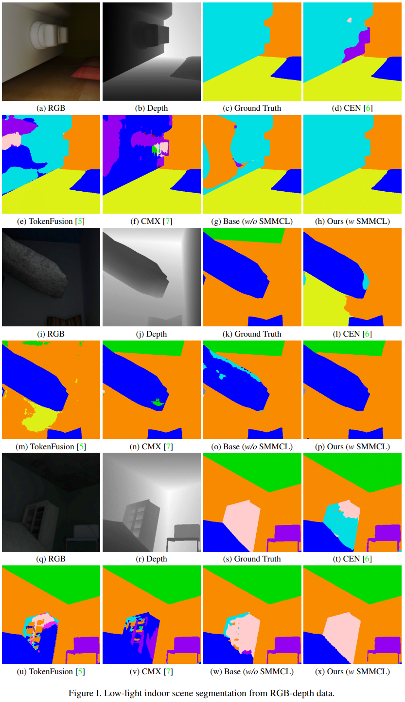
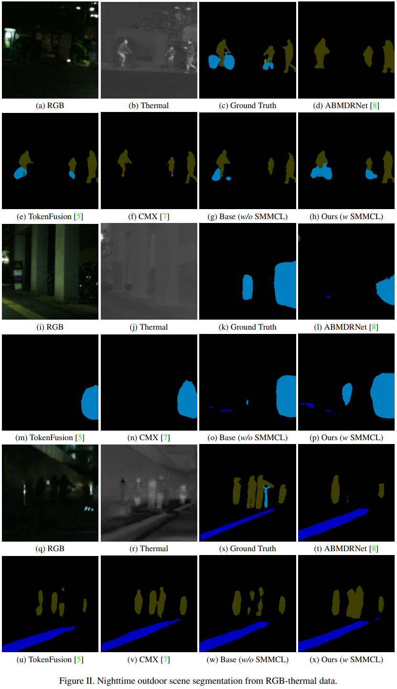
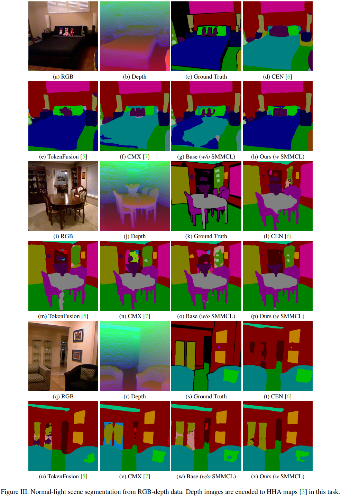

# SMMCL
PyTorch implementation of "Understanding Dark Scenes by Contrasting Multi-Modal Observations"  
[[WACV paper](https://openaccess.thecvf.com/content/WACV2024/papers/Dong_Understanding_Dark_Scenes_by_Contrasting_Multi-Modal_Observations_WACV_2024_paper.pdf), [supp](https://openaccess.thecvf.com/content/WACV2024/supplemental/Dong_Understanding_Dark_Scenes_WACV_2024_supplemental.pdf)] [[arXiv paper](https://arxiv.org/abs/2308.12320), [supp](https://drive.google.com/file/d/1Cfn70-Y9JXUuVcFNTk8162w4-YA32W-K/view?usp=sharing)]


## Updates
**[2023/10/24]** Paper was accepted by WACV2024. We thank anonymous reviewers from ICCV2023 and WACV2024 for their suggestions to our paper. See you in Hawaii.   
**[2024/01/05]** Camera-ready version is available online.  
**[2024/04/22]** Code will be released today.


## Abstract
Understanding dark scenes based on multi-modal image data is challenging, as both the visible and auxiliary modalities provide limited semantic information for the task. Previous methods focus on fusing the two modalities but neglect the correlations among semantic classes when minimizing losses to align pixels with labels, resulting in inaccurate class predictions. To address these issues, we introduce a supervised multi-modal contrastive learning approach to increase the semantic discriminability of the learned multi-modal feature spaces by jointly performing cross-modal and intra-modal contrast under the supervision of the class correlations. The cross-modal contrast encourages same-class embeddings from across the two modalities to be closer and pushes different-class ones apart. The intra-modal contrast forces same-class or different-class embeddings within each modality to be together or apart. We validate our approach on a variety of tasks that cover diverse light conditions and image modalities. Experiments show that our approach can effectively enhance dark scene understanding based on multi-modal images with limited semantics by shaping semantic-discriminative feature spaces. Comparisons with previous methods demonstrate our state-of-the-art performance. 


<p align="center">  </p>

<p align="center">  </p>

<p align="center">  </p>

## Citation
```
@InProceedings{Dong2024SMMCL,
  author    = {Dong, Xiaoyu and Yokoya, Naoto},
  title     = {Understanding Dark Scenes by Contrasting Multi-Modal Observations},
  booktitle = {WACV},
  year      = {2024}
}
```
